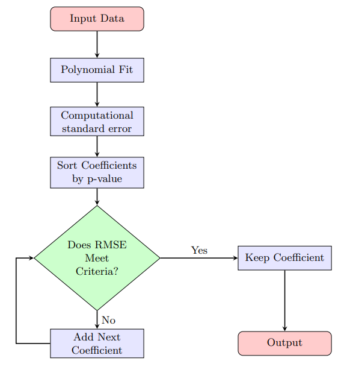

# Reduction of muscle-tendon kinematic parameterization
This repository contains the main function to reduce the polynomials used to parameterize muscle-tendon lengths and moment arms.
The method presented here is the one published in:

Harba, M.; Badia, J.; Serrancolí, G. XXXX. YYYY.

In this code, in <a href="Main_polynomials.m">Main_polynomials.m</a>, we first compute full polynomials parameterizing muscle-tendon lengths (lMT) and moment arms from joint coordinates, following the method presented in <a href="https://doi.org/10.1016/j.jbiomech.2003.12.017">Menegaldo et al. 2004</a> and also used in multiple optimal control problems <a href="https://doi.org/10.1371/journal.pone.0217730">Falisse at al. 2019</a>, <a href="https://doi.org/10.7717/peerj.10975">Haralabidis at al. 2021</a>, or <a href="https://doi.org/10.1371/journal.pcbi.1012219">D'Hondt et al. 2024</a>. First, random skeletal positions are generated to cover the entire expected range of motion within the movements. Then, the coefficients of the polynomials are computed based on a least-square approach, so that the reconstructed lMT and moment arms represent the ones of the model. 

The main contribution presented in the mentioned publication is the reduction of those polynomials (within <a href="Polynomial_reduction.m">Polynomial_reduction.m</a>, which is called at the end of <a href="Main_polynomials.m">Main_polynomials.m</a>). First, the polynomial coefficients are ordered according to the significance of this term within the whole polynomial. To do this, the standard error (SE) was computed, the t-term was computed dividing the coefficient by SE, and then the p-value associated with it was obtained. All coefficients were sorted by its computed p-value. Then, starting from the first coefficient, we test if the resulting polynomial meets the requiring accuracy criteria (measured by the maximum of RMSE of the lMT and moment arms). If the resulting polynomial meets the criteria, that polynomial would be the "reduced polynomial", if not, we add the following coefficient of the list and we asses the accuracy again. See the following flowchart.

  

